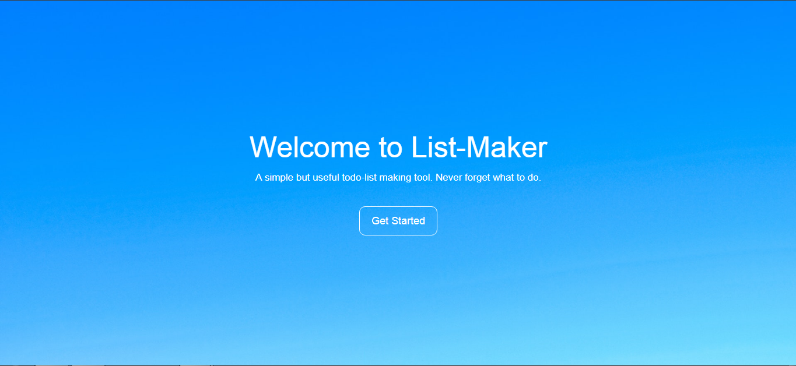
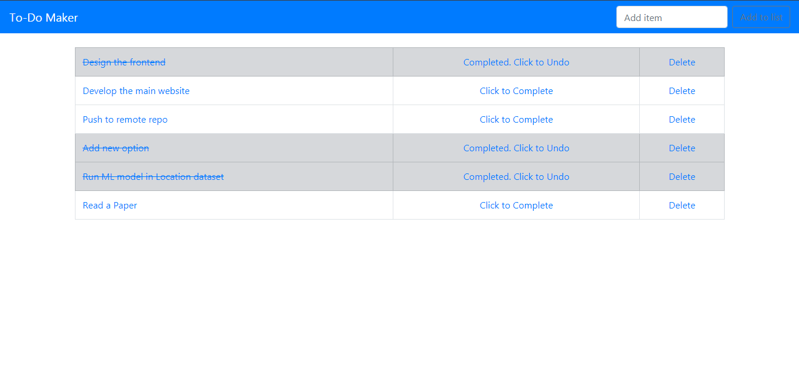
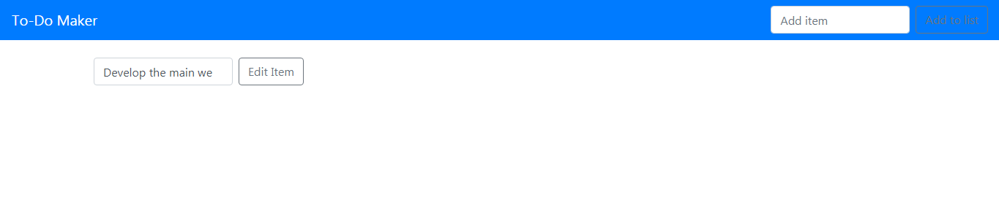
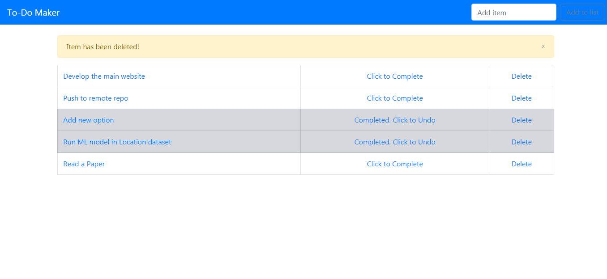

# Todo
A simple online Todo web application. It is still in development

# Features
* Create List
* Edit item from the list
* Cross-off completed items
* Delete completed items

# Screenshots

Landing page

Main page

Edit item of the list

Completed item deleted (Upon user)

# Tools
* Python (Django Framework)
* HTML
* CSS
* Bootstrap4
* SQLite3

# Upcoming Features
* User Registration/Login
* Different boards for different lists.
